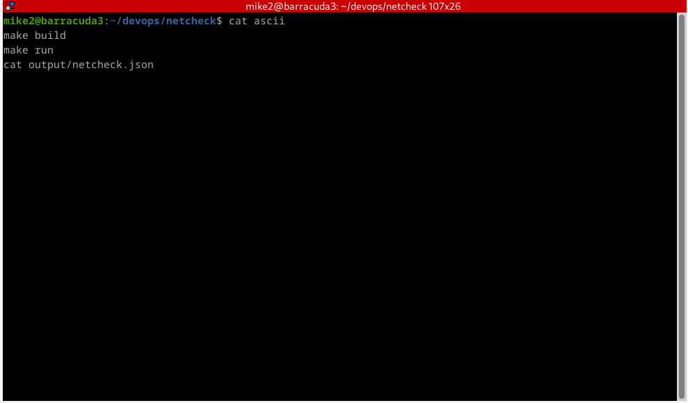

# ⚙️ DevOps Toolbox in Rust

A collection of minimal, fast, and CI/CD-ready DevOps tools written in Rust.

This project showcases how Rust can be used to build production-grade system utilities with clear structure, safe execution, and excellent performance — all designed for Linux environments and terminal-based operations.

---

## 🧱 Modules

| Tool         | Description                                | Status     |
|--------------|--------------------------------------------|------------|
| `netcheck`   | HTTP health checker with logging + JSON    | ✅ Complete |
| `procwatch`  | Process monitor with CLI filtering         | ✅ Complete |
| `perfstat`   | System performance: CPU, memory, disk      | ✅ Complete |
| `netpeek`    | DNS resolver + IP probe + reachability     | ✅ Complete |
| `textshaper` | *(Coming soon)* Text/Log filtering toolkit | 🕓 Planned  |

---

## 📦 Folder Structure

```

rust-devops/
├── netcheck/       # HTTP check CLI
├── procwatch/      # Process monitoring CLI
├── perfstat/       # System stats collector
├── netpeek/        # Network diagnostics CLI
├── textshaper/     # (to be added)
└── README.md       # This file

````

---

## 🌐 Module: `netcheck`

**A minimal Rust CLI for HTTP health checks.**  
Built for DevOps pipelines, CI/CD integration, and infrastructure observability.

### 🚀 Features

- Takes a URL as input
- Performs a `GET` request
- Measures response time
- Logs output to file and JSON
- Exits with status `0` (success) or `1` (failure)

### 🎥 Demo



### 🧰 Usage

```bash
cd netcheck
make build
make run
./target/release/netcheck https://example.com
````

### 📁 Output

* JSON: `output/netcheck.json`
* Logs: `logs/netcheck.log`

---

## 🧠 Module: `procwatch`

**A lightweight Rust CLI for Linux process monitoring.**
Built for system introspection, CI pipelines, and automation scenarios.

### 🚀 Features

* Lists all active processes via `/proc`
* Shows `PID`, `Name`, `Status`
* Filter by name: `--filter <name>`
* Saves output as structured JSON
* Logs executions with timestamps

### 🧰 Usage

```bash
cd procwatch
make build
./target/release/procwatch --filter sshd
```

### 📁 Output

* JSON: `output/procs.json`
* Logs: `logs/procwatch.log`

### 📤 Example

```
[322] sshd (Sleeping)
[1311] sshd (Sleeping)
```

```json
[
  {
    "pid": 322,
    "name": "sshd",
    "status": "Sleeping"
  }
]
```

---

## 🧠 Module: `perfstat`

**A compact Rust CLI to capture system performance stats.**
Ideal for system snapshots, log-based observability and automation triggers.

### 🚀 Features

* Captures total + used memory (RAM)
* Captures swap usage
* Captures load averages (1m, 5m, 15m)
* Captures disk usage
* Saves JSON + logs execution with timestamp

### 🧰 Usage

```bash
cd perfstat
make build
make run
```

### 📁 Output

* JSON: `output/stats.json`
* Logs: `logs/perfstat.log`

### 📤 Example Output

```text
📊 perfstat @ 2025-07-08T21:14:02Z
- Memory: 3749848/8000128 KB
- Swap:   0/2097148 KB
- Load Average: 1m: 0.14, 5m: 0.08, 15m: 0.06
- Disk Usage: 18900000000 / 51200000000 bytes
```

```json
{
  "timestamp": "2025-07-08T21:14:02Z",
  "total_memory": 8000128,
  "used_memory": 3749848,
  "total_swap": 2097148,
  "used_swap": 0,
  "load_avg": [0.14, 0.08, 0.06],
  "disk_total": 51200000000,
  "disk_used": 18900000000
}
```

---

## 📡 Module: `netpeek`

**A Rust CLI for network visibility and diagnostics.**
It resolves domains, fetches your public IP, and checks reachability — without root.

### 🚀 Features

* DNS resolution (`example.com` → IPs)
* Fetches external IP (`https://httpbin.org/ip`)
* Reachability check via TCP port 80
* Outputs structured JSON
* CI/CD and monitoring ready

### 🧰 Usage

```bash
cd netpeek
make build
make run
```

### 📁 Output

* JSON: `output/netpeek.json`
* Logs: `logs/netpeek.log`

### 📤 Example Output

```text
🌐 netpeek @ 2025-07-08T21:41:00Z
- Domain: example.com
- Resolved IPs: ["93.184.216.34"]
- External IP: 189.102.88.42
- Reachable: true
```

```json
{
  "timestamp": "2025-07-08T21:41:00Z",
  "domain": "example.com",
  "resolved_ips": ["93.184.216.34"],
  "external_ip": "189.102.88.42",
  "reachable": true
}
```

---

## 📜 License

MIT — free to use, modify, and distribute.

> Built with 🦀 by [Mike Niner](https://github.com/mikeninerbravog)