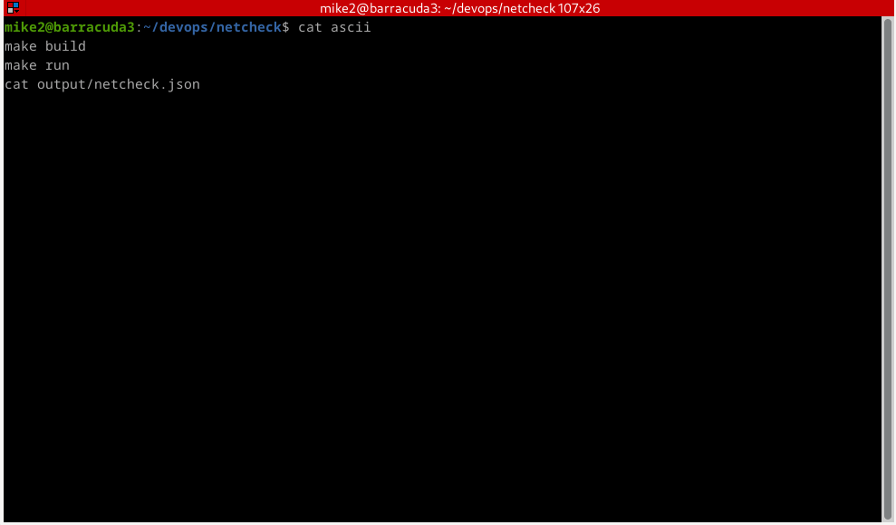

# 🧪 netcheck

**A minimal Rust CLI for HTTP health checks.**  
Built for DevOps pipelines, CI/CD integration, and infrastructure observability.

---

## 🚀 What It Does

- Takes a URL as input
- Performs a `GET` request
- Measures response time
- Logs output to file and JSON
- Exits with status `0` (success) or `1` (failure)

---

## 🎥 Demo




## 📦 Project Structure

```

netcheck/
├── input/               # Reserved for external configs or URL list (future)
├── output/              # Stores JSON result per run
├── logs/                # Execution logs per run
├── src/main.rs          # Core Rust logic
├── Makefile             # Shortcut commands
└── README.md            # This file

````

---

## 🧰 Usage

### 🔧 Build the binary

```bash
make build
````

### 🌐 Run against a URL

```bash
make run                      # Default example
./target/release/netcheck https://your-url.com
```

### 🔍 Output

```text
[INFO] Checking URL: https://example.com
[OK] 2025-07-08T19:32:11Z | URL: https://example.com | Status: 200 OK | Time: 2446ms
```

* JSON output: `output/netcheck.json`
* Log file: `logs/netcheck.log`

---

## 📈 Integration

This tool is CI/CD ready.

You can use `netcheck` in:

* GitHub Actions
* GitLab CI
* Drone pipelines
* Custom Bash scripts

Example:

```yaml
- name: Healthcheck API
  run: ./target/release/netcheck https://api.example.com
```

---

## 📖 License

MIT — Free to use, modify and distribute.

> Made with 🦀 by [Mike Niner](https://github.com/mikeninerbravog-showcase)